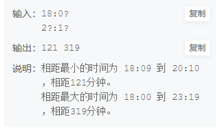

# ranko手表枚举法

## 描述
ranko 的手表坏了，正常应该显示 xx:xx 的形式（4 个数字），比如下午 1 点半应该显示 13:30 ，但现在经常会有一些数字有概率无法显示。
ranko 在  t1t1​ 时刻看了下时间，过了一段时间在 t2t2​ 时刻看了下时间。她想知道， t1t1​ 和 t2t2​ 这两个时刻之间相距的时间的最大值和最小值是多少？
保证 t1t1​ 在 t2t2​ 之前（且 t1t1​ 和 t2t2​ 不等）。t1t1​和 t2t2​在同一天的 00:00 到 23:59 之间。 \

## 思路
反向试探法(反向穷举法，枚举法），从0000到23*60+59，看看这个时间适不适合 18：0？ 或者2？：1？的规则
，适合就加入分别对应的数组，然后遍历两个数组找到最大最小值。
## 答案
``` c
#include <stdio.h>

int main() {
    char time1[10];
    char time2[10];
    scanf("%s", time1);
    scanf("%s", time2);

// 如果符合time1的加入array1
// time2的加入time2
    int array1[10000] = {-1};
    int p1 = 0;
    int array2[10000] = {-1};
    int p2 = 0;
    int MaxTime = 23 * 60 + 59; //最大时间

    for (int i = 0; i <= MaxTime; i++) {
        int hour = i / 60;
        int minu = i % 60;
        // 每个位置符合
        if ((hour / 10 + '0' == time1[0] || time1[0] == '?') &&
                (hour % 10 + '0' == time1[1] || time1[1] == '?') &&
                (minu / 10 + '0' == time1[3] || time1[3] == '?') &&
                (minu % 10 + '0' == time1[4] || time1[4] == '?')) {
            // printf("%d%d:%d%d",hour/10,hour%10,minu/10,minu%10);
            array1[p1++] = i;
        }
        if ((hour / 10 + '0' == time2[0] || time2[0] == '?') &&
                (hour % 10 + '0' == time2[1] || time2[1] == '?') &&
                (minu / 10 + '0' == time2[3] || time2[3] == '?') &&
                (minu % 10 + '0' == time2[4] || time2[4] == '?')) {
            // printf("%d%d:%d%d",hour/10,hour%10,minu/10,minu%10);
            array2[p2++] = i;
        }


    }
    int min = 1000000;
    int max = -1;

    for (int i = 0; i < p1; i++) {
        for (int j = 0; j < p2; j++) {
            if (array2[j] > array1[i]) {
                min = (array2[j] - array1[i]) < min ? (array2[j] - array1[i]) : min;
                max = (array2[j] - array1[i]) > max ? (array2[j] - array1[i]) : max;
            }
            // else if (array1[i]>array2[j]){
            //  min=(array1[i]-array2[j])<min?(array1[i]-array2[j]):min;
            //     max = (array1[i]-array2[j])>max?(array1[i]-array2[j]):max;
            // }
        }
    }
    printf("%d %d", min, max);
    return 0;
}
```

## [题目网站](https://www.nowcoder.com/practice/37275e85ae7c4453920eae6b9f7f45fc?tpId=308&tqId=1714944&ru=/exam/oj&qru=/ta/algorithm-start/question-ranking&sourceUrl=%2Fexam%2Foj)
