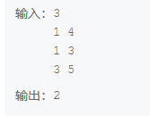

# 活动安排

## 描述
给定nn个活动，每个活动安排的时间为[ai,bi)[ai​,bi​)。求最多可以选择多少个活动，满足选择的活动时间两两之间没有重合。

## 思路
贪心算法
先将活动越快结束排在前面排序。
顺序遍历所有活动，如果此活动开始时间比已经添加的活动的最晚结束时间大那么添加此活动。

## 答案
``` c
#include <stdio.h>
#include <stdlib.h>
void quickSort(int *a, int *b, int low, int high)
{
    int i = low; //第一位
    int j = high; //最后一位

    int temp = (low+high)/2;
    int keya = a[temp]; //将第一个数作为基准值-- 先找到一个基准值
    int keyb = b[temp];
    a[temp]=a[i];
    b[temp]=b[i];

    //进行排序---> 最终结果就是 左面的 都比基准值小 ，右面的都比 基准值大，所以这是所有循环的结束条件

    while (i < j)
    {
        //下面的循环执行的条件是 如果右面的比基准值大，就赋一下值，否则继续向前移动
        //---如果直接把循环写成下面这样---
        //while(a[j] >= key) //如果下面的不写这个i<j,这个就出错、越界，并且排序不准--理由：
        //如果i<j,并且： 右面的值 大于 基准值 时，j往前移动一个
        //i 跟 j 的可能情况 只有 i<j i==j
        while(i < j && b[j] >= keyb)//i<j 是 当前while循环的结束条件，如果没有这个，i会大于j，出现越界，错误
        {
            j--;//继续走
        }//如果不成立，也就是 a[j] <= key;右面的比key小了，那就换个位置
        //把a[j]的数据给a[i]
        b[i] = b[j];
        a[i] = a[j];

        //将事先保存好的基准值与左边的值进行比较，如果基准值大，保持不变，i往前
        //然后 判断一下这个新的a[i]，也就是之前的a[j]跟key值的关系---> 一定是 a[i]<key
        //所以把i向前移动一下，i++
        while(i < j && b[i] < keyb)
        {
            i++;
        }
        //移动完以后，把新的位置的a[i]的数值 给刚才的 a[j],然后开始下一次循环
        b[j] = b[i];
        a[j] = a[i];
    }

    //跳出循环，将基准值放入数据a[i]中
    b[i] = keyb;
    a[i] = keya;
    //对基准值左边 的所有数据 再次进行快速查找（递归）
    if (i-1 > low)
    {
        quickSort(a, b, low, i-1);
    }

    //对基准值右边的所有数据再次进行快速查找（递归）
    if (i+1 < high)
    {
        quickSort(a, b, i+1, high);
    }

    return ;
}

    int main() {
        int n;
        scanf("%d", &n);
        int* a = (int*)malloc(sizeof(int) * n);
        int* b = (int*)malloc(sizeof(int) * n);

        for (int i = 0; i < n; i++) {
            scanf("%d", &a[i]);


            scanf("%d", &b[i]);

        }
        quickSort(a, b, 0, n - 1);

        int border = b[0];
        int count = 1;
        for (int i = 1; i < n; i++) {
            if (border <= a[i]) {
                border = b[i];
                count++;
            }
        }
        printf("%d", count);
        return 0;
    }
```

## [题目网站](https://www.nowcoder.com/practice/16d971e9e42e4f3b9b1e2b8794796a43?tpId=308&tqId=2373697&ru=/exam/oj&qru=/ta/algorithm-start/question-ranking&sourceUrl=%2Fexam%2Foj)
