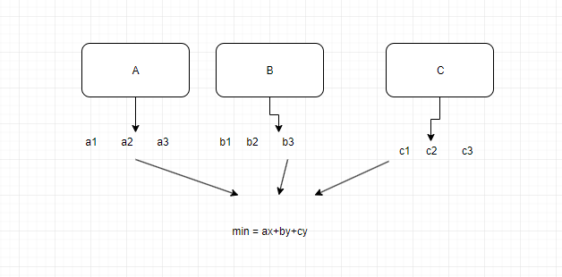
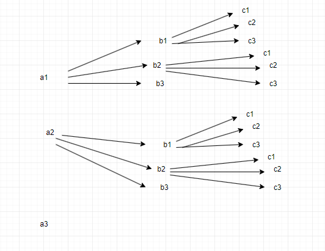

# kotori和素因子

## 描述
 kotori拿到了一些正整数。她决定从每个正整数取出一个素因子。但是，kotori有强迫症，她不允许两个不同的正整数取出相同的素因子。\

她想知道，最终所有取出的数的和的最小值是多少？\

注：若 a mod k==0amodk==0，则称 kk 是 aa 的因子。若一个数有且仅有两个因子，则称其是素数。显然1只有一个因子，不是素数。

## 思路


每个之间都相互试一下，找到最小值，同时ax,by,cz,如果不重复都放入一个新数组，

## 答案
``` c
 //思路：将每个数都取出一个不同的因子，依次相加，在对比选出最小的，
// 例如第一个数有a, b因子，第二个数有a，c,d因子，那么对比a+c,a+d,b+a,b+c,b+d,得到最小的。

#include <stdio.h>
#include <math.h>
#include <limits.h>
#include <malloc.h>

int n;             // 全局变量，所有函数随便用
int min = INT_MAX; // 最大int数，用来变小的
int isPrime(int i) {
    for (int j = 2; j <= sqrt(i); j++) {
        if (i % j == 0) {
            return 0;
        }
    }
    return 1;
}

void kotori(int* a, int* b, int index, int sum) {
    if (index == n) {
        // 多种情况比较，选出最小的,如果有因子相同的情况就到不了最后一步
        // 所以min不会被改变，就表示找不到
        if (min > sum) {
            min = sum;
        }

        return;
    }
    for (int i = 2; i <= a[index]; i++) {
        if (a[index] % i == 0 && isPrime(i)) {
            // 选出a[index]的因子
            int j = 0;
            for (; j < index; j++) {
                if (i == b[j]) {
                    break;
                }
            } // 和以往进来的因子比较，不是相同的
            if (j == index) {
                b[index] = i; // 不同的就可以进入b数组
                kotori(a, b, index + 1, sum + i);

            }
        }
    }
}
int main() {
    scanf("%d", &n);

    int* a = (int*)malloc(sizeof(int) * n);  // 装输入数
    int* b = (int*)malloc(sizeof(int) * n);  // 装每个数出的一个因子

    for (int i = 0; i < n; i++) {
        scanf("%d", &a[i]);
    }

    kotori(a, b, 0, 0);
    if (min == INT_MAX) {
        printf("-1");
    } else {
        printf("%d", min);
    }

    return 0;
}
```

## [题目网站](https://www.nowcoder.com/practice/7b1c858a3e7a41ed8364178979eaae67?tpId=308&tqId=500564&ru=/exam/oj&qru=/ta/algorithm-start/question-ranking&sourceUrl=%2Fexam%2Foj)
