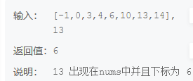

# 二分查找发

## 描述
 请实现无重复数字的升序数组的二分查找

给定一个 元素升序的、无重复数字的整型数组 nums 和一个目标值 target ，写一个函数搜索 nums 中的 target，如果目标值存在返回下标（下标从 0 开始），否则返回 -1


## 思路
双指针移动，进行二分法，关键找到边界值即可
## 答案
``` c
#include <stdio.h>
int search(int* nums, int numsLen, int target ) {

    int l = 0;
    int r = numsLen-1;
    while(l<=r){
        int mid =( r+l)/2;
        if(nums[mid]==target){
            // printf("%d",mid);
            return mid;
        }else if(nums[mid]>target){
            r=mid-1;

        }else{
            l=mid+1;
        }
    }
    return -1;
}
```

## [题目网站](https://www.nowcoder.com/practice/d3df40bd23594118b57554129cadf47b?tpId=308&tags=&title=&difficulty=0&judgeStatus=0&rp=0&sourceUrl=%2Fexam%2Foj)
