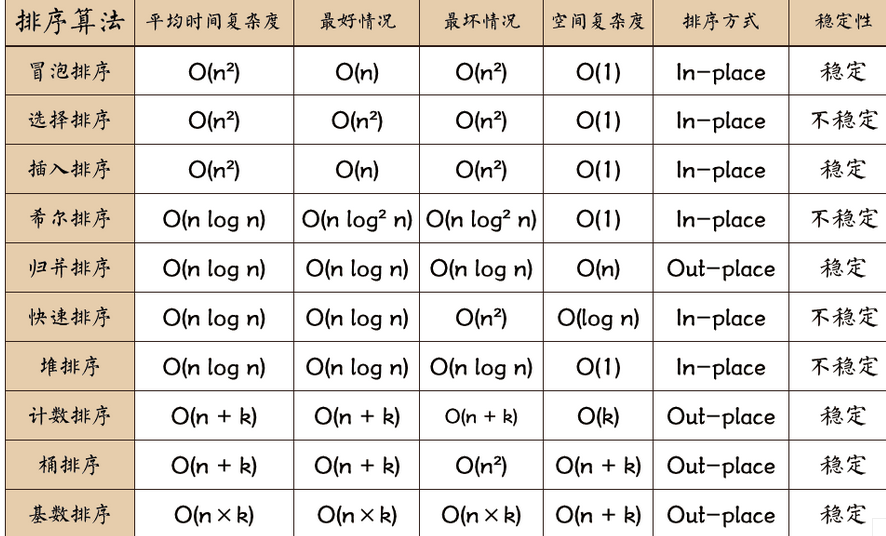

# 常见排序

## 描述
 给定一个长度为 n 的数组，请你编写一个函数，返回该数组按升序排序后的结果。

数据范围： 0≤n≤1×1030≤n≤1×103，数组中每个元素都满足 0≤val≤1090≤val≤109
要求：时间复杂度 O(n2)O(n2)，空间复杂度 O(n)O(n)
进阶：时间复杂度 O(nlogn)O(nlogn)，空间复杂度 O(n)O(n)

注：本题数据范围允许绝大部分排序算法，请尝试多种排序算法的实现。

## 思路
十大排序\

## 冒泡
``` c
int* Bubble(int* arr, int arrLen, int* returnSize ) {
    // write code here
    for(int i =0;i<arrLen;i++){
        for(int j=0;j+1<arrLen-i;j++){
            if(arr[j]>arr[j+1]){
                int tmp = arr[j];
                arr[j] = arr[j+1];
                arr[j+1] = tmp;
            }
        }
    }
    returnSize[0] = arrLen;
    return arr;
}
```
## 快速
``` c
int* Quick(int* arr, int arrLen, int* returnSize ) {
    // write code here
    for(int i =0;i<arrLen;i++){
        for(int j=0;j+1<arrLen-i;j++){
            if(arr[j]>arr[j+1]){
                int tmp = arr[j];
                arr[j] = arr[j+1];
                arr[j+1] = tmp;
            }
        }
    }
    returnSize[0] = arrLen;
    return arr;
}
```

## [题目网站](https://www.nowcoder.com/practice/2baf799ea0594abd974d37139de27896?tpId=308&tags=&title=&difficulty=0&judgeStatus=0&rp=0&sourceUrl=%2Fexam%2Foj)
