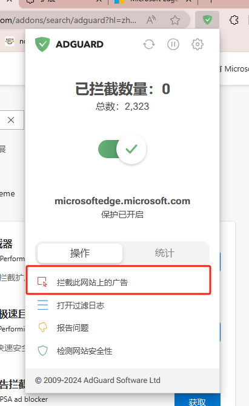
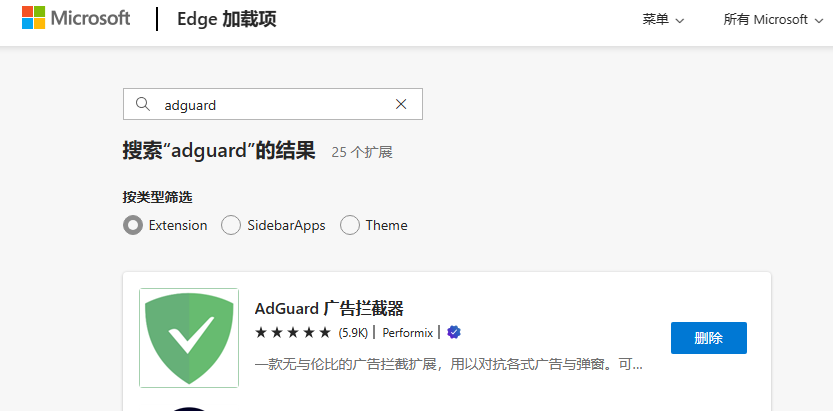

# adguard
adguard是一款浏览器插件，可以屏蔽网站上大多数广告，防止眼睛被其他东西污染，从而专心聚焦于自己想要查找的内容。
其次，自己可以使用它屏蔽不想要的元素。点击拦截此网站上的广告，不一定需要拦截广告，圈出其他讨厌的元素也可以屏蔽。\

# 下载方式
1.浏览器进入插件市场
## [edge进入网站：](https://microsoftedge.microsoft.com/addons/search/adguard?hl=zh-CN)
2.下载即可

