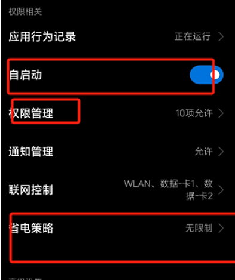
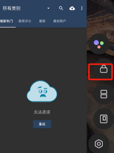

# macrodroid
macrodroid是一款免费的安卓手机自动化即手动设置任务，当条件满足时（早上九点了），自动执行相应简单的任务（打开听歌软件，播放自定义歌曲）

# 下载地址
## [地址](https://www.aliyundrive.com/s/ytNSqYGU78g)

# 配置关键
给予此软件自启动、防误杀、无省电策略等\
 \

之后进行Trigger actions 配置即可