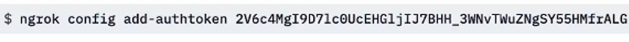

# ngrok
是一个内网穿透工具，如果没有公共ip地址（一般向网络供应商购买）以及ip地址和内网ip映射建立，那么直接使用ngrok是一个很方便的选择

# 下载安装

## [官网地址](https://ngrok.com/docs/getting-started/?os=windows)

# 使用方式

1.第一次使用时，进入相应文件夹，用cmd打开， 配置token

2.进入相应文件夹，用cmd打开
命令：\
使用固定域名：ngrok http --domain=solely-tops-hen.ngrok-free.app 80\
本地80端口就被映射到了此域名上，每个用户都可以免费在官网申请一个域名 \
开启配置的所有通道: ngrok start -all (此付费功能)

# 问题
电脑端打不开，映射的网址\
原因：没有开启ipv6支持，一般从浏览器，本电脑系统，
最近交换机，最近路由器排查，开启ipv6支持即可
