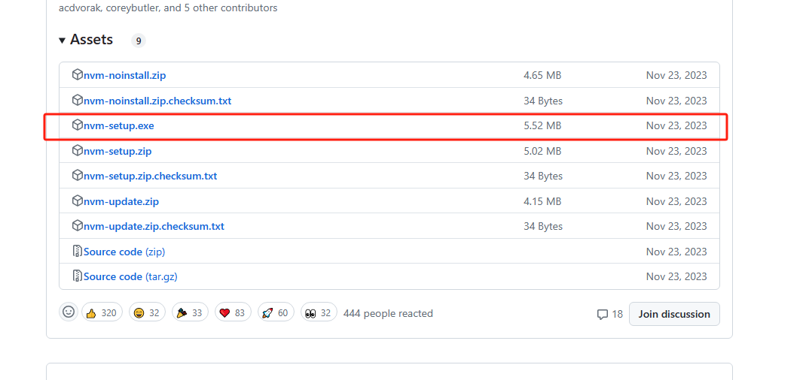

# nvm
nvm全称 node version management,即node版本控制器
当面临项目a只能用node version 16，项目b只能用node 8时，不用
卸载当前版本再次安装新node时候使用

# 下载地址
## [github](https://www.aliyundrive.com/s/ytNSqYGU78g)

# 使用命令
nvm -help 查看所有操作\
nvm list 查看已安装node的所有版本\
nvm use 16 切换成 node 16.x.x版本\
nvm install 16 下载16版本